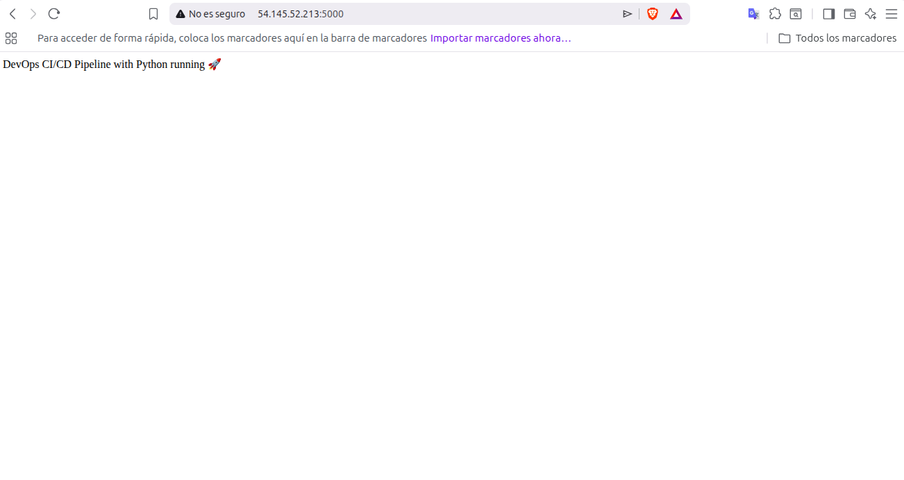
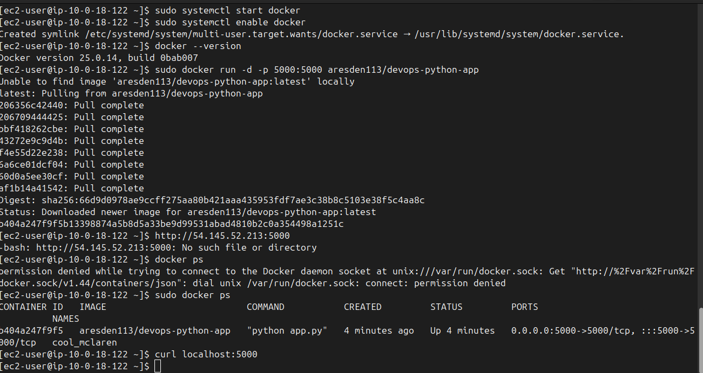
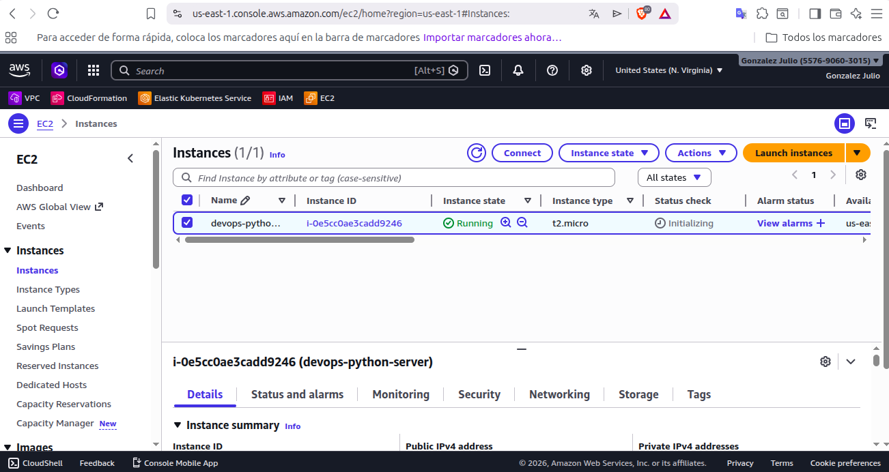

# 🚀 DevOps Python App Deployment

Simple DevOps project demonstrating how to build and deploy a Python application using **Docker** on an **AWS EC2 instance**.

This project shows a basic DevOps workflow including containerization, cloud deployment and infrastructure exposure to the internet.

---

# 📌 Project Overview

This project consists of a Python web application packaged inside a Docker container and deployed to an AWS EC2 instance.

The container exposes the application on port **5000**, allowing access through the instance's public IP.

---

# 🧰 Technologies Used

* AWS EC2
* Docker
* Python
* Linux (Amazon Linux 2023)
* Docker Hub
* SSH

---

# 🏗️ Architecture

```
User Browser
     ↓
Public Internet
     ↓
AWS EC2 Instance
     ↓
Docker Container
     ↓
Python Application (Port 5000)
```

---

# 📷 Application Running

Add here a screenshot of the application running in the browser.

Example:

```
http://YOUR_PUBLIC_IP:5000
```



---

# 🐳 Docker Container Running

Screenshot showing the container running with the command:

```
docker ps
```



---

# ☁️ EC2 Instance

Screenshot from the AWS console showing the running EC2 instance.



---

# 🔧 Deployment Steps

### 1️⃣ Connect to EC2 via SSH

```
ssh -i key.pem ec2-user@YOUR_PUBLIC_IP
```

---

### 2️⃣ Install Docker

```
sudo dnf install docker -y
sudo systemctl start docker
sudo systemctl enable docker
```

---

### 3️⃣ Run the container

```
sudo docker run -d -p 5000:5000 aresden113/devops-python-app
```

---

### 4️⃣ Access the application

Open in your browser:

```
http://YOUR_PUBLIC_IP:5000
```

---

# 📂 Project Structure

```
devops-python-app
│
├── app.py
├── requirements.txt
├── Dockerfile
├── README.md
└── images
    ├── app-running.png
    ├── docker-container.png
    └── ec2-instance.png
```

---

# 🎯 Learning Objectives

This project demonstrates:

* Containerizing applications using Docker
* Deploying containers on AWS EC2
* Exposing applications to the internet
* Basic DevOps deployment workflow

---

# 🚀 Possible Improvements

Future improvements for this project:

* Add **Nginx reverse proxy**
* Implement **CI/CD with GitHub Actions**
* Use **Terraform for infrastructure as code**
* Add **HTTPS with Let's Encrypt**
* Deploy with **Docker Compose**

---

# 👨‍💻 Author

**Julio González**

DevOps enthusiast focused on cloud infrastructure, automation and container orchestration.

---

⭐ If you like this project feel free to star the repository!
